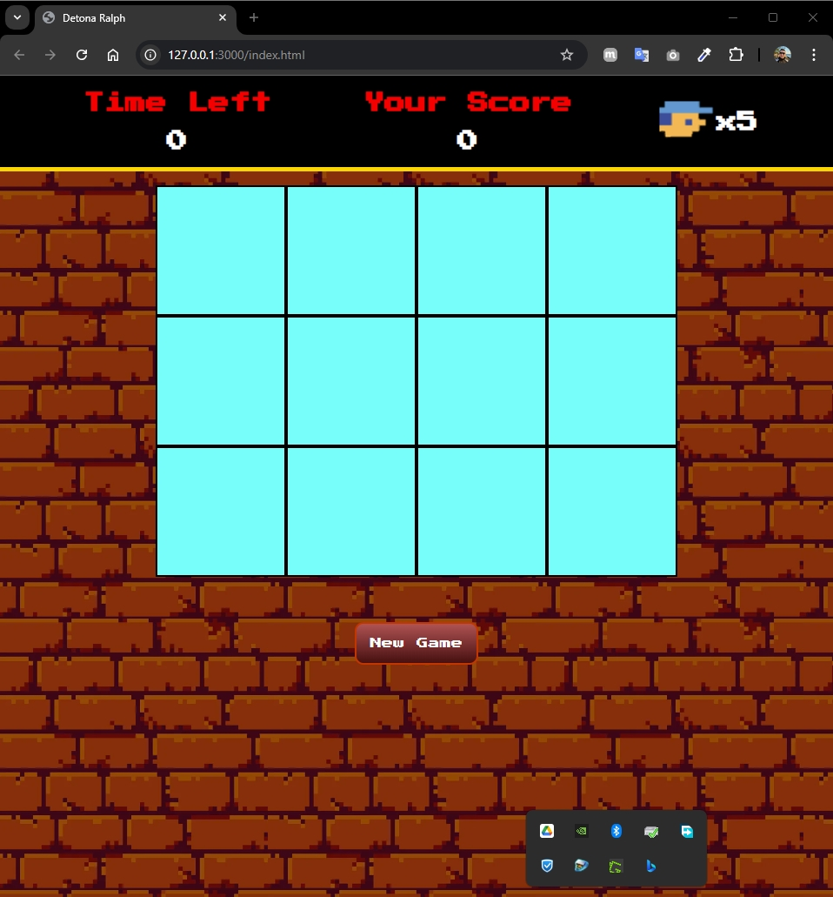
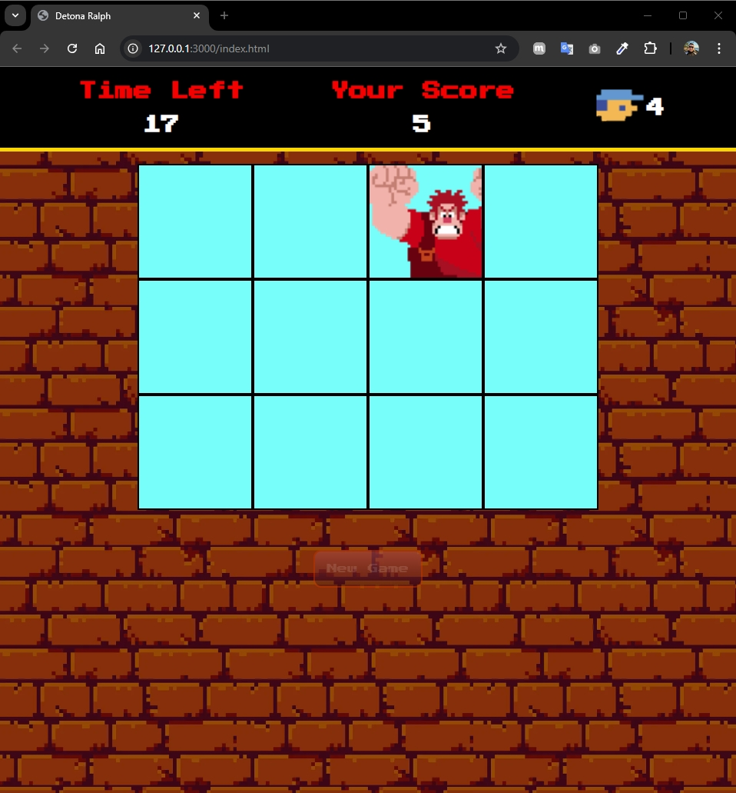
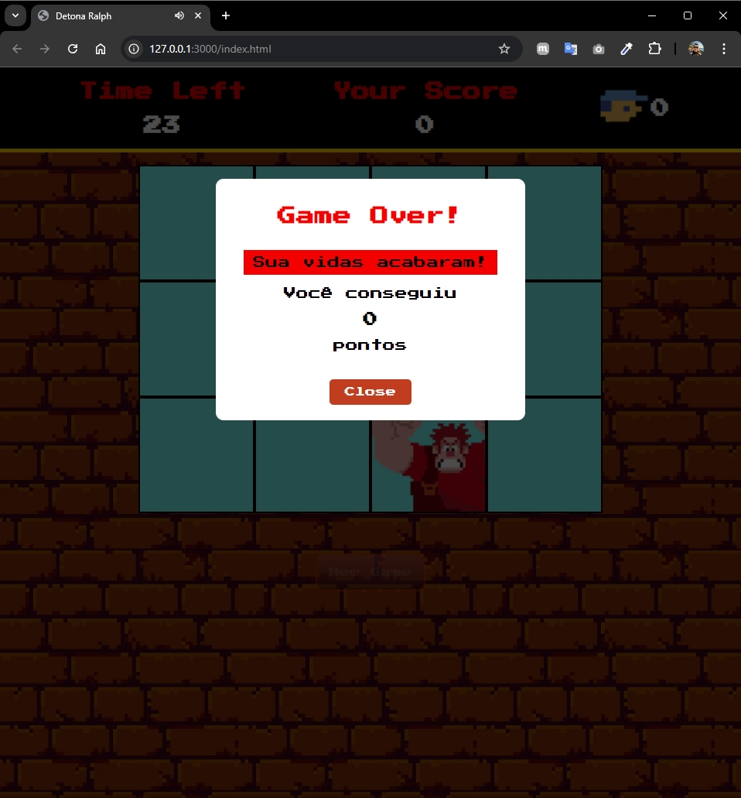

# Projeto de game criado durante o bootcamp _Ri Happy - Front-end do Zero da [DIO.me](https://web.dio.me)_

### O game se trata de um point-and-click simples, o objetivo é acertar o clique do mouse na imagem que aparece na janela e que muda randomicamente de local.

No desenvolvimento foram utilizadas as seguintes tecnologias:

Foram aplicados conceitos de variáveis _view, values e actions_ e boas práticas em organização dos diretórios. Não foram aplicadas técnicas de HTML semântico por tratar-se de um projeto pequeno e ser mais focado em JavaScript.

---

